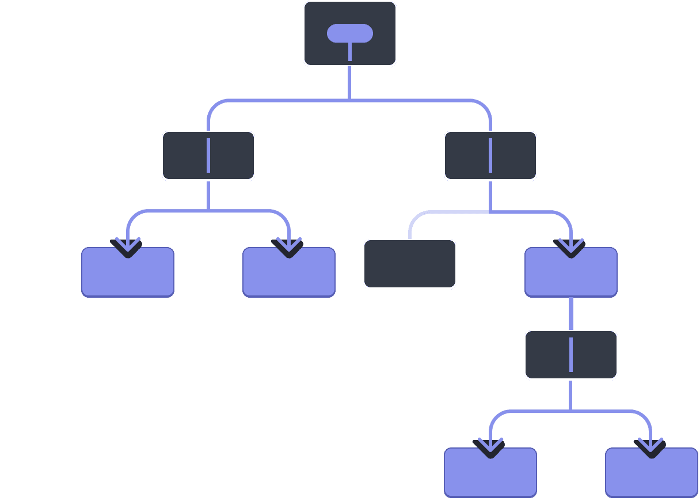

# props 組件的信息傳遞 (父傳子)

React 的組件 使用 props 來將 父組件 的訊息 傳遞給 子組件。
他可以傳遞 任何 JavaScript值，包括 對象、數組、函數。



---

## 數據傳遞的方法

1. 父組件 (傳遞)
   
   1. 單獨傳遞
      
      將每個信息，透過 屬性標籤 單獨傳遞過去
      
      ```tsx
      <Component 
       name={userData.name} 
       age={userData.age} 
       sex={userData.sex}/>
      ```
   
   2. 同時傳遞
      
      將所有 信息 包裝起來，就可以一次傳遞過去
      
      ```tsx
      <Component {...userData}/>
      ```

2. 子組件 (接收)
   
   在 頁面函數 的 參數區域 中，設定要接受的變數名稱
   
   ```tsx
   const Component = (props: any) => {
       return (
           <ul>
               <li>姓名：{props.name}</li>
               <li>年齡：{props.age}</li>
               <li>性別：{props.sex}</li>
           </ul>
       )
   }
   export default Component
   ```

---

## 範例

- index.tsx
  
  ```tsx
  import { PageContainer } from '@ant-design/pro-layout';
  import React from 'react';
  import SubDom from './components/subDom';
  
  const VDOM: React.FC = () => {
      // 要傳遞的數據
      const userData = {
          name: '王大明',
          age: 25,
          sex: '男'
      }
      return (
          <PageContainer>
              {/* 這種寫法 是將每個要傳遞的屬性 單獨寫出來 */}
              <div>
                  <h1>單獨傳遞</h1>
                  <SubDom name={userData.name} age={userData.age} sex={userData.sex}/>
              </div>
  
              {/* 下面的寫法，代表傳遞 userData 中全部的屬性 */}
              <div>
                  <h1>同時傳遞</h1>
                  <SubDom {...userData}/>
              </div>
  
          </PageContainer>
      )
  }
  
  export default VDOM
  ```

```
- subDom.tsx

```tsx
const Component = (prpos: any) => {
    return (
        <ul>
            <li>姓名：{prpos.name}</li>
            <li>年齡：{prpos.age}</li>
            <li>性別：{prpos.sex}</li>
        </ul>
    )
}
export default Component
```
